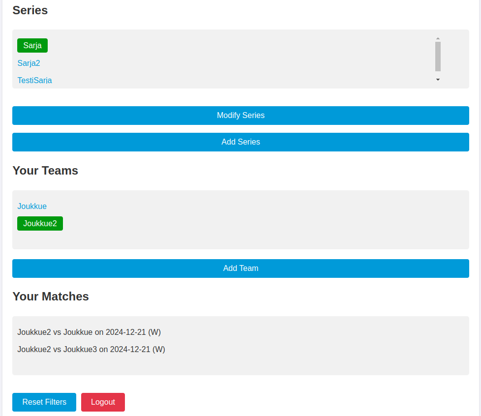

# Possession Tracker
Possession Tracker: https://possession-tracker-dce8c.web.app/ is a sports analytics app designed to help users track and analyze ball or puck possession during a game. The app simplifies data collection and provides insights into possession conversions, shots, and goals. Users can save key game information, enabling post-game analysis and future enhancements such as predictive analytics based on past games.

## Key Features

Interactive Field Grid:
The app features an 8x4 grid subdivided into 4x4 sections, allowing users to accurately log in-game actions.

Mark where possession is gained and lost.
Record whether possession resulted in a shot and, if so, whether the shot led to a goal.
All actions are recorded with visual notifications, using the Toastify dependency for user feedback.

### Data Management:

Front End:
Built with React and Vite for a fast and responsive user experience.
Hosted on Google Firebase for seamless deployment and scalability.

Back End:
Developed with Django, providing robust APIs for user authentication and data interaction.
Users can create accounts to store game data, access past matches, or record new ones.
A dashboard allows account management and related information, such as creating and managing series and teams, which can then be utilized in the front end.

#### Use Case
The app is particularly useful for coaches, players, or sports enthusiasts who want a simple yet effective way to analyze game performance. The structure also supports use by sports clubs, enabling them to manage multiple teams playing in different series.

##### Planned Features
In future updates, the app will incorporate predictive analytics to leverage past game data for generating educated guesses about future game outcomes.